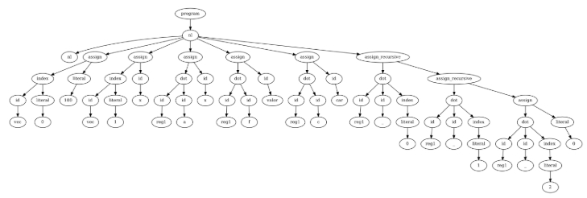

# Entrega Parcial Práctica Final 'Viper'
**Procesadores del Lenguaje**

**Alberto Penas Díaz**:

NIA: 100471939 

Correo: 100471939@alumnos.uc3m.es Titulación: Ingeniería informática 

**Héctor Álvarez Marcos**:

NIA: 100495794 

Correo: 100495794@alumnos.uc3m.es Titulación: Ingeniería informática 

Alberto Penas Díaz | Héctor Álvarez Marcos 

Entrega Parcial Ejercicio Final  

## Índice

1. [Analizador Léxico](#Analizador-Léxico)
2. [Analizador Sintáctico](#Analizador-Sintáctico)  
   - [Definición formal de la gramática](#Definición-formal-de-la-gramática)  
   - [Decisiones principales de diseño de la gramática](#Decisiones-principales-de-diseño-de-la-gramática)
3. [Batería de Pruebas](#Batería-de-Pruebas)  
   - [Aclaraciones Importantes](#Aclaraciones-Importantes)
4. [Contenido Extra: Visualización del Árbol Sintáctico](#Contenido-Extra-Visualización-del-Árbol-Sintáctico)

# Analizador Léxico
Para el analizador léxico, hemos definido la secuencia de tokens que se han especificado en el enunciado,  teniendo  en  cuenta  como  tokens  los  comentarios  simples  y  los  comentarios multilínea, para llevar un conteo de la línea del código actual, usada para llevar a cabo una forma trazable de recuperación de errores. Se han definido, además, una serie de palabras reservadas, de nuevo, las especificadas en el enunciado. 

A tener en cuenta, esta vez se exporta un fichero .token con los tokens hallados en el fichero de entrada. Cabe mencionar que se espera que el fichero de entrada tenga extensión .vip, ya que de no ser así, el fichero de tokens reescribirá el fichero de entrada. 
# Analizador Sintáctico
Para el desarrollo de la gramática, se ha seguido cuidadosamente los requisitos y limitaciones del  enunciado,  habiendo  optado  (por  simplicidad  y  limpieza  de  código)  no  usar  las indentaciones propuestas, si no los *brackets* de apertura y cierre.    

# Definición formal de la gramática 

De manera formal, nuestro diseño de gramática es el siguiente: 

G = {NT, T, P, S} 

∑NT={ S,program, statement\_list, statement, declaration, assignment, if\_statement, while\_statement, register,  var\_list,  var\_decl,  decl\_assign,  reference,  rest\_ref, funct\_decl, funct\_call, arg\_funct\_call, type\_funct,  arg\_funct,  arg\_funct2,  arg\_funct\_rec,  extra, another, block\_funct, funct\_ret, newlines, else, block, expression}

∑T={  INT\_TYPE,  FLOAT\_TYPE,  CHAR\_TYPE,  BOOL\_TYPE,  ID,  TYPE,  TRUE,  FALSE, COMMENT, MLCOMMENT, DEF, RETURN, IF, ELSE, WHILE, DOT, LBRACKET, RBRACKET, LBRACE,  RBRACE,  LPAREN,  RPAREN,  COMMA,  COLON,  SEMICOLON,  PLUS,  MINUS, TIMES, DIVIDE, GT, LT, GE, LE, EQ, EQUALS,  AND, OR, NOT, DECIMAL, BINARY, OCTAL, HEXADECIMAL, FLOAT\_CONST, CHAR\_CONST,NEWLINE } 

P = { 

S ::= program 

program ::= statement\_list 
| λ 

statement\_list ::= statement\_list statement   | statement 

statement ::= declaration NEWLINE | assignment NEWLINE | if\_statement | TYPE register | while\_statement | COMMENT NEWLINE | MLCOMMENT NEWLINE 
| funct\_decl  | funct\_call NEWLINE | NEWLINE 

declaration ::= INT\_TYPE var\_list | FLOAT\_TYPE var\_list   | CHAR\_TYPE var\_list | BOOL\_TYPE var\_list 
 | ID var\_list 

register ::= ID COLON block 

var\_decl ::= ID decl\_assign | LBRACKET expression RBRACKET ID decl\_assign decl\_assign ::= EQUALS expression  | λ 

var\_list ::= var\_list COMMA var\_decl | var\_decl 

assignment ::= reference EQUALS assignment  | reference EQUALS expression reference ::= ID rest\_ref 

rest\_ref ::= λ  | DOT ID rest\_ref | LBRACKET expression RBRACKET rest\_ref funct\_decl ::= DEF type\_funct ID LPAREN arg\_funct RPAREN COLON block\_funct funct\_call ::= ID LPAREN arg\_funct\_call RPAREN 

arg\_funct\_call ::= expression COMMA arg\_funct\_call | expression | λ 

type\_funct ::= INT\_TYPE  | FLOAT\_TYPE | BOOL\_TYPE  | CHAR\_TYPE  | ID arg\_funct ::= type\_funct arg\_funct2 | λ 

arg\_funct2 ::= ID extra another 

arg\_funct\_rec ::= type\_funct ID extra another 

extra ::= COMMA ID extra | λ 

another ::= SEMICOLON arg\_funct\_rec | λ 

block\_funct ::= newlines LBRACE statement\_list funct\_ret RBRACE NEWLINE funct\_ret ::= RETURN expression newlines 

newlines ::= NEWLINE | λ 

if\_statement ::= IF expression COLON block else\_ else\_ ::= newlines ELSE COLON block  | NEWLINE while\_statement ::= WHILE expression COLON block block ::= newlines LBRACE statement\_list RBRACE 

expression ::= expression PLUS expression | expression MINUS expression 
| expression TIMES expression | expression DIVIDE expression | expression EQ expression   | expression GT expression  | expression LT expression  | expression GE expression 
| expression LE expression | expression AND expression | expression OR expression 
| NOT expression | MINUS expression | PLUS expression | LPAREN expression RPAREN   | DECIMAL | BINARY | OCTAL | HEXADECIMAL | FLOAT\_CONST | TRUE  | FALSE   | CHAR\_CONST | funct\_call | reference 

} 
## Decisiones principales de diseño de la gramática 
Las decisiones de diseño principales de la gramática han sido el cómo consideramos nosotros el  tratamiento  de  los  “newlines”.  Básicamente consideramos tanto uno como n newlines seguidos un único token newline, por lo que por ejemplo, en los casos de control de flujo if/else, entre el cierre de llaves del if y del else puede haber tantos \n como guste, como ocurre en otros lenguajes, no hemos querido hacer limitación en eso. Otro punto es el tema ya mencionado de la elección de brackets, ya que para mantener una estructura limpia, todos los tokens  de  llave  derecha  “}”,  que  implican  el  cierre  de  una  serie  de  sentencias,  de  un controlador de flujo o de un bloque de función van a ir seguidos de un salto de linea, con el fin de evitar nuevas declaraciones o sentencias en la misma línea del cierre de llaves. El único caso en el que esto no funciona así es en el bucle if/else, ya que se permite que justo después del cierre del bloque if, sí y sólo si va un “else”, se permita ponerlo a la misma altura. De esta forma: 

if b: { 

`   `x = x + 1                                          

}else :                                      Este es el único caso en el que se puede escribir algo que no  {                                               sea \n después de un cierre de llaves.      

`   `x = x - 1 

}  

Tampoco  se  podrá  realizar  el  cierre  de  múltiples  bloques  de  llaves  de  forma consecutiva(“}}}...”) ya que como se ha dicho, después de cada llave tiene que existir un salto de línea. 

Otro tema a considerar es que nosotros dentro de los índices de un vector permitimos al lenguaje  encapsular  todo  tipo  de  expresiones,  incluidas  por  ejemplo  las  de  tipo  float  y booleano,  pese  a  que  sabemos que luego en el semántico va a producir error porque se necesita una expresión de tipo entero, pero entendemos que eso es un punto a tratar en la próxima parte de la práctica. Por ende, el resto \*de momento\* son válidos. Así pues, se puede asignar al índice de un vector la llamada a una función. Luego será cosa del sintáctico el verificar por ejemplo que esa función tenga una sentencia de retorno que sea de tipo entero, pero a ese punto no tenemos que llegar todavía, simplemente se han descartado las opciones que son sintácticamente incorrectas. 

Cabe mencionar, además, que cuando existe algún error sintáctico en el fichero de entrada, se imprime la línea en la que se encuentra, de forma en la que se señala exactamente dónde se encuentra el error y se recupera del mismo pasando directamente a la siguiente línea. 
#  Batería de Pruebas
Para la batería de pruebas, hemos generado un *shell script* con distintos casos de prueba. Estos casos siguen la estructura “v[n]\_[referencia\_a\_funcionalidad\_test]” ∀ n ∈ ℕ y se basan en  la  generación  de  un  archivo  temporal en el directorio /temp (el cual es eliminado al finalizar la ejecución de las pruebas) y la comparación de este fichero con la salida esperada almacenada en los ficheros con estructura “v[n]\_[referencia\_a\_funcionalidad\_test]\_expected” ∀ n ∈ ℕ. 

Si se quisiera visualizar la salida de cada uno de los ficheros de entrada del programa, basta con  comentar  o eliminar la última sentencia del fichero de test *run.sh*, que es la que se encarga  de  eliminar  el  directorio  temporal  que  se  ha creado. Esto se puede hacer de la siguiente manera:  

\# rm -rf temp 

Por  otra  parte,  los  casos  inválidos  tratan  de  explorar  los  “casos  límite”  de  nuestra implementación, revisando la gestión de errores tanto en la apertura del archivo de entrada, como errores reconocidos en el ámbito del léxico, del sintáctico, como errores puramente matemáticos, como la no división por 0. Estos casos de error siguen la misma estructura que los válidos, pero con nombre “i[n]\_[referencia\_a\_funcionalidad\_test].vip” ∀ n ∈ ℕ. 

En cada uno de los ficheros de los casos de prueba se explica más en detalle qué se está tratando de comprobar específicamente, todos ellos situados en el directorio test\_files. 
## Aclaraciones Importantes 
**IMPORTANTE**: esta práctica se ha desarrollado en equipos linux. Para ejecutar un fichero de  Python  en  equipos  con  arquitectura  linux,  basta  con  poner  en  terminal  python3 <nombre del archivo>.Sin  embargo  esto  puede  cambiar en equipos con MacOS o Windows, ya que es posible que para ejecutar un fichero de python en estos equipos haya que introducir por terminal python <nombre del archivo>.Si este fuera el caso, solo hace falta cambiar la linea 22 del fichero run.sh de la siguiente manera:  

Cambiar:  

python3 main.py "$input\_file" > "$output\_file" por:

python main.py "$input\_file" > "$output\_file" 

Además, es importante mencionar que si no se puede ejecutar el fichero run.sh, es posible que haya que darle permisos de administrador con el comando chmod +x run.sh 
# Contenido Extra: Visualización del Árbol Sintáctico
Para facilitar el desarrollo del árbol sintáctico, se ha utilizado una herramienta para poder visualizar de forma gráfica el árbol resultante de la siguiente manera:  

Este árbol nos sirve como base para ver cómo se está formando la gramática **pero no es explícitamente el árbol que genera un analizador sintáctico LALR**. Se ha generado para ayudarnos a ver gráficamente cómo se producen las derivaciones de las reglas de producción. Para la ejecución del mismo, se ha modificado levemente el protocolo de lanzamiento del programa, de forma que si se quiere exportar dicho árbol, se ha de introducir por terminal la siguiente sentencia:  

python3 main.py true

Es necesario que el tercer parámetro de la sentencia sea la palabra “true”. En caso de no serlo, se imprimirá por terminal un mensaje de error, explicando cómo se tiene que ejecutar. Es muy importante mencionar, además, que esta visualización depende del paquete “graphviz”, por lo que para usarlo se deberá tener instalado. Lo que no quiere decir que el programa no pueda usarse en caso de no tenerlo: es puramente opcional. 

Los resultados obtenidos se guardarán en el directorio /tree\_gen/ en formato pdf 
7 

